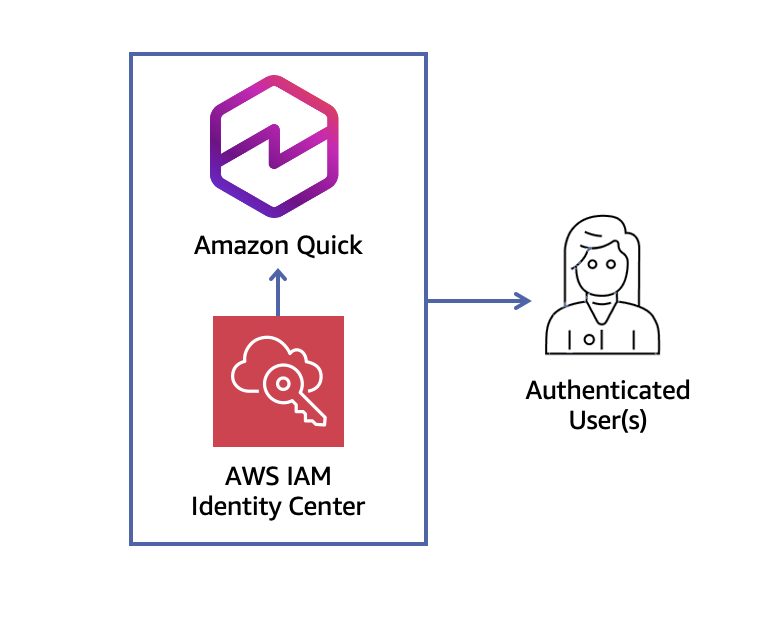

# Amazon Quick Suite Bootstrap - Terraform

This Terraform module sets up Amazon Quick Suite with IAM Identity Center integration.

## Features

- Creates or uses existing IAM Identity Center instance
- Sets up QuickSight account subscription
- Creates admin group in Identity Center
- Configures necessary IAM roles and policies
- Deploys Lambda function for automated setup

## Prerequisites

- AWS CLI configured with appropriate credentials
- Terraform >= 1.0.0
- Python 3.12 (for Lambda function)
- pip (for installing Lambda dependencies)

## Quick Start

1. **Clone and navigate to the module:**
   ```bash
   cd terraform/quick-suite-bootstrap
   ```

2. **Create your variables file:**
   ```bash
   cp terraform.tfvars.example terraform.tfvars
   ```

3. **Edit `terraform.tfvars` with your values:**
   ```hcl
   aws_region                   = "us-east-1"
   quick_suite_account_name     = "MyQuickSuite"
   quick_suite_admin_email      = "admin@mycompany.com"
   quick_suite_admin_group_name = "QuickSuiteAdmins"
   ```

4. **Initialize Terraform:**
   ```bash
   terraform init
   ```

5. **Review the plan:**
   ```bash
   terraform plan
   ```

6. **Apply the configuration:**
   ```bash
   terraform apply
   ```

## Variables

| Name | Description | Type | Default | Required |
|------|-------------|------|---------|----------|
| `aws_region` | AWS region to deploy resources | `string` | `"us-east-1"` | No |
| `identity_center_instance_arn` | ARN of existing IAM Identity Center instance | `string` | `""` | No |
| `quick_suite_account_name` | Name for the Quick Suite account | `string` | `"QuickSuiteBootstrap"` | No |
| `quick_suite_admin_email` | Email address for the Quick Suite admin | `string` | `"admin@example.com"` | No |
| `quick_suite_admin_group_name` | Name of the admin group in Identity Center | `string` | `"QUICK_SUITE_ADMIN"` | No |
| `force_update` | Set to true to force re-run of setup | `bool` | `false` | No |
| `tags` | Additional tags to apply to resources | `map(string)` | `{}` | No |

## Outputs

| Name | Description |
|------|-------------|
| `identity_center_instance_arn` | ARN of the IAM Identity Center instance |
| `identity_store_id` | ID of the Identity Store |
| `lambda_function_arn` | ARN of the Quick Suite setup Lambda function |
| `lambda_function_name` | Name of the Lambda function |
| `lambda_execution_role_arn` | ARN of the Lambda execution role |
| `quick_suite_account_name` | Name of the Quick Suite account |
| `quick_suite_admin_email` | Admin email for Quick Suite |
| `quick_suite_admin_group_name` | Admin group name in Identity Center |

## Architecture



## Using with Existing Identity Center

If you already have an IAM Identity Center instance, provide its ARN:

```hcl
identity_center_instance_arn = "arn:aws:sso:::instance/ssoins-1234567890abcdef"
```

## Force Re-run Setup

To force the Lambda to re-run the setup (e.g., after configuration changes):

```bash
terraform apply -var="force_update=true"
```

## Cleanup

To destroy all resources:

```bash
terraform destroy
```

**Note:** This will attempt to delete the QuickSight subscription and related resources.

## Troubleshooting

### Lambda Build Fails
Ensure Python 3.12 and pip are installed:
```bash
python3 --version
pip3 --version
```

### Permission Errors
The Lambda function requires extensive permissions. Ensure your AWS credentials have sufficient privileges to create IAM roles and policies.

### Identity Center Issues
If using an existing Identity Center, ensure the ARN is correct and your credentials have access to it.

## License

This project is licensed under the [MIT-0 (MIT No Attribution)](LICENSE) license.

## Related Resources

- [Amazon Quick Documentation](https://docs.aws.amazon.com/quicksuite/)
- [IAM Identity Center Documentation](https://docs.aws.amazon.com/singlesignon/)
- [Terraform AWS Provider](https://registry.terraform.io/providers/hashicorp/aws/latest/docs)
