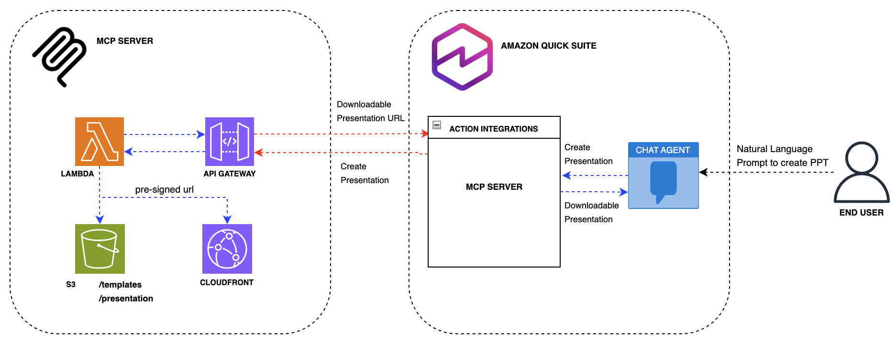
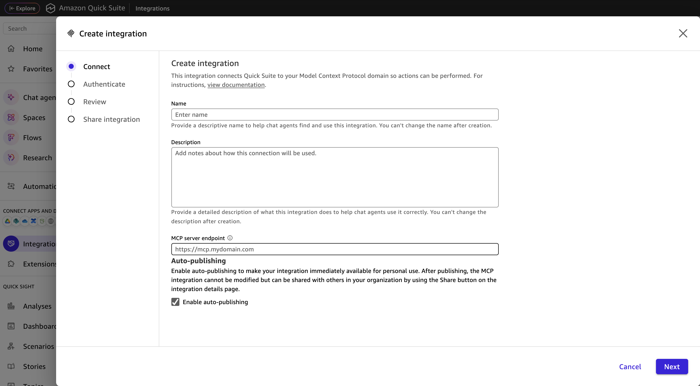
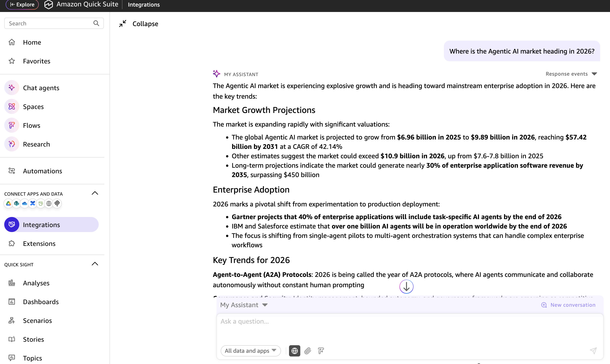
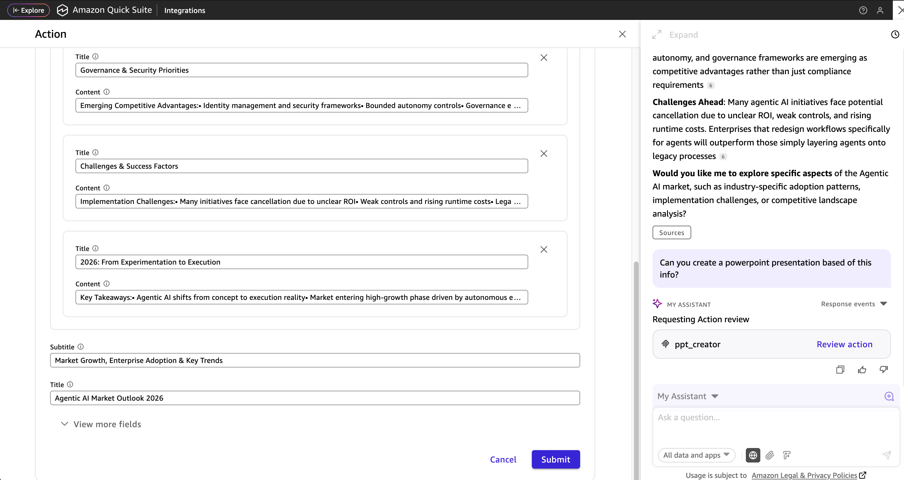
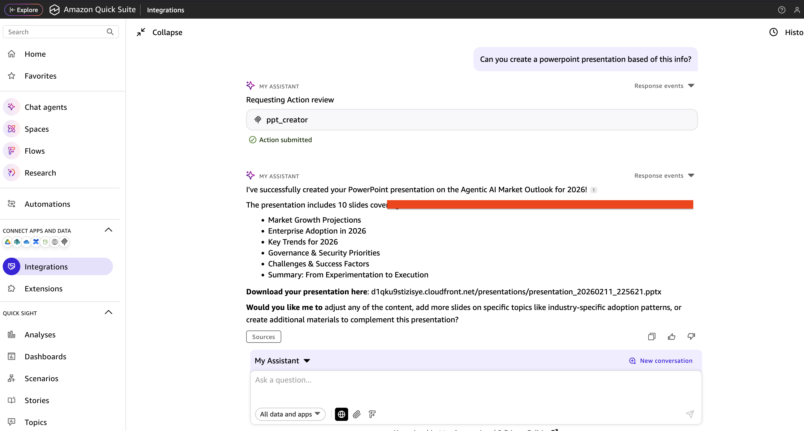

# Build Custom MCP Server Integration with Amazon Quick Suite to create Power Point Presentations

This guide demonstrates how to build a custom Model Context Protocol (MCP) server integration that enables Amazon Quick Suite to generate PowerPoint presentations directly from chat conversations. By creating this integration, users can leverage Quick Suite's AI capabilities to transform their ideas, data, and content into professional presentations without leaving their workflow. The MCP server acts as a bridge between Quick Suite's conversational interface and PowerPoint generation functionality, allowing users to simply describe their presentation needs in natural language and receive fully-formatted slides complete with titles, content, and structured layouts. This integration showcases the extensibility of Amazon Quick Suite's platform and provides a practical template for building custom actions that enhance workplace productivity.

## Architecture Overview

This MCP (Model Context Protocol) server integration leverages a serverless architecture on AWS to enable PowerPoint presentation generation from Amazon Quick Suite's chat interface. The solution is designed for scalability, reliability, and seamless integration with Quick Suite's action framework.
Components

## AWS Lambda Function

    - Core processing engine that handles presentation generation requests
    - Utilizes Lambda Layers for shared dependencies and PowerPoint manipulation libraries
    - Processes incoming requests from Quick Suite and orchestrates the presentation creation workflow
    - Executes business logic to transform user input into structured slide content

## Amazon API Gateway

    - Serves as the RESTful API endpoint for the MCP server
    - Provides secure, scalable access to the Lambda function
    - Handles request validation and routing from Quick Suite to the backend
    - Manages authentication and authorization for incoming requests (future state)

## Amazon S3

    - Stores PowerPoint templates used as base files for presentation generation
    - Hosts generated presentation files (.pptx) after creation
    - Provides durable, scalable storage for both input templates and output artifacts
    - Enables versioning and lifecycle management for presentation assets

## Amazon CloudFront

    - Delivers generated presentations via secure, pre-signed URLs
    - Provides low-latency access to presentation files for end users
    - Returns downloadable links directly to the Quick Suite chat interface
    - Ensures fast, global distribution of generated content

## Integration Flow

    1. User initiates a presentation request through Amazon Quick Suite chat
    2. Quick Suite invokes the MCP server action via API Gateway
    3. Lambda function receives the request with presentation parameters (title, content, slides)
    4. Lambda retrieves the appropriate template from S3
    5. Lambda generates the PowerPoint presentation using the template and user-provided content
    6. Generated presentation is stored in S3
    7. CloudFront pre-signed URL is created for secure access
    8. URL is returned to Quick Suite and displayed to the user in the chat interface

This architecture ensures a responsive, scalable solution that integrates seamlessly with Amazon Quick Suite's conversational AI capabilities while maintaining security and performance standards.

## Deployment Guide

## Prerequisites

- AWS CLI configured with appropriate credentials
- Terraform >= 1.0
- Python 3.11
- pip

## Quick Start

1. **Clone the repository**

    git clone <https://github.com/aws-samples/sample-amazon-quick-suite-knowledge-hub.git>
    cd docs/integration/actions/MCP/powerpoint-creator-mcp

2. **Configure AWS region (optional)**

    export TF_VAR_aws_region="us-west-2"

3. **Deploy with Terraform**

    terraform init
    terraform apply

4. **Note the outputs**
   After deployment, save these values:
   - `api_gateway_url` - MCP server endpoint
   - `cloudfront_domain_name` - CDN for presentations
   - `s3_bucket_name` - Storage bucket

## Custom Template (optional)

Place your PowerPoint template at `templates/template.pptx`. The template should have:

- A title slide (layout 0) with title and subtitle placeholders
- A content slide layout (layout 1) for additional slides

## MCP Server Integration

1. Go to Amazon Quick Suite --> Integrations --> Actions --> Model Context Protocol

    

2. Enter a name, description and api_gateway_url from terraform output to MCP server endpoint and click Next

3. Click Next and Finish

## Testing

1. Ask any question to the Chat Agent in Amazon Quick Suite. Ex: "Where is the Agentic AI market heading in 2026?"

2. Ask the Chat Agent to create a powerpoint presentation based on the output from previous prompt. Review the information in the pop up window and submit.

3. Quick Suite will respond with a downloadable link to the created presentation. Copy and paste in a browser to download.

## Cleanup

    terraform destroy

Note: This will delete all generated presentations in S3.

## License

This project is licensed under the MIT License - see the [LICENSE](LICENSE) file for details.

## Authors and Acknowledgment

- **Primary Developer**: Leo Mentis
- **AWS Services**: Amazon Quick Suite, AWS Lambda, Amazon S3, Amazon API Gateway, Amazon Cloudfront
- **Protocol**: Model Context Protocol (MCP) specification
