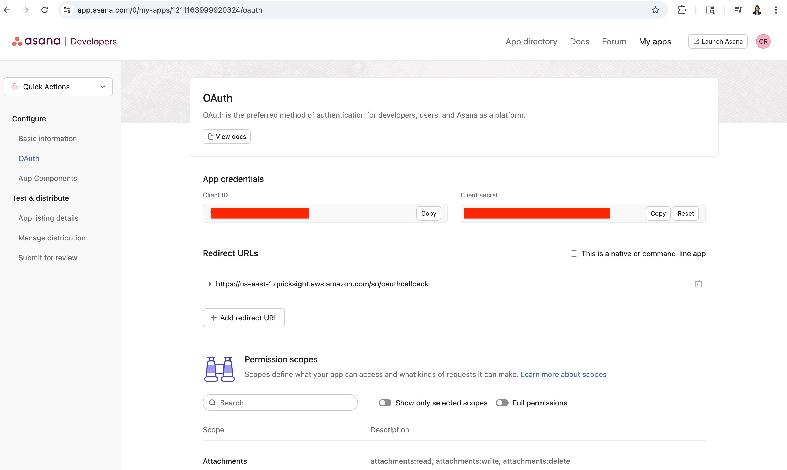
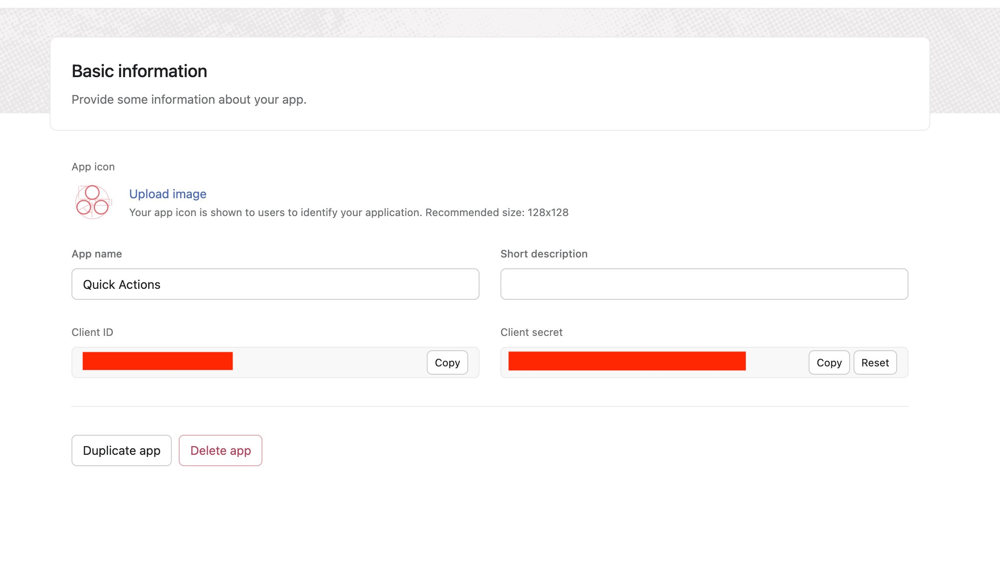
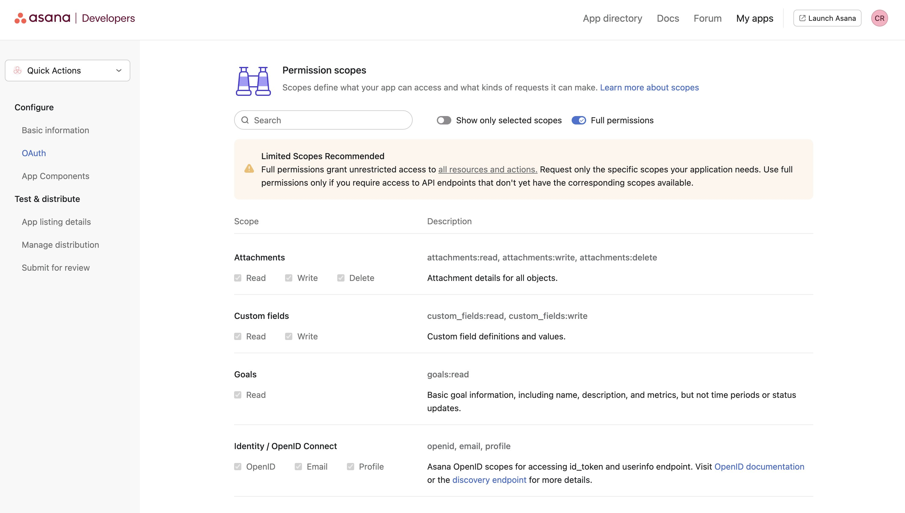
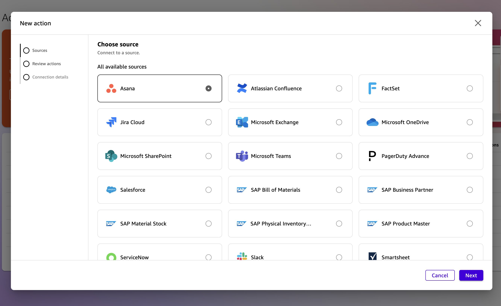
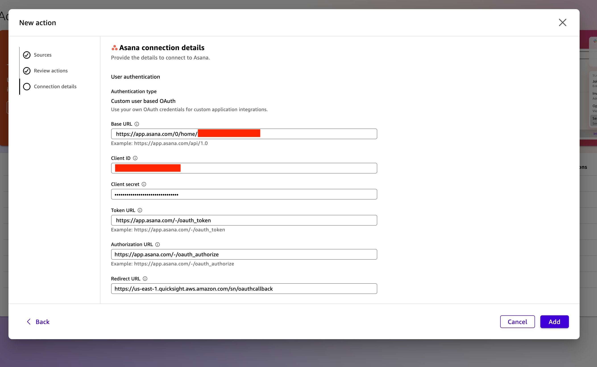
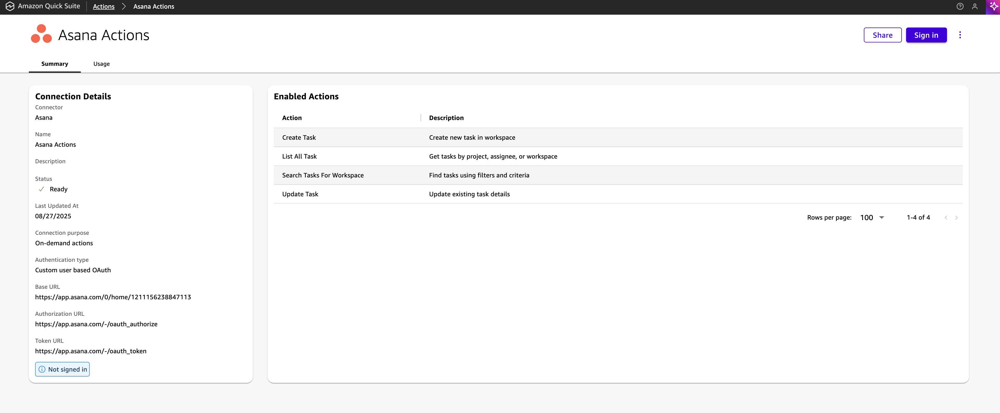
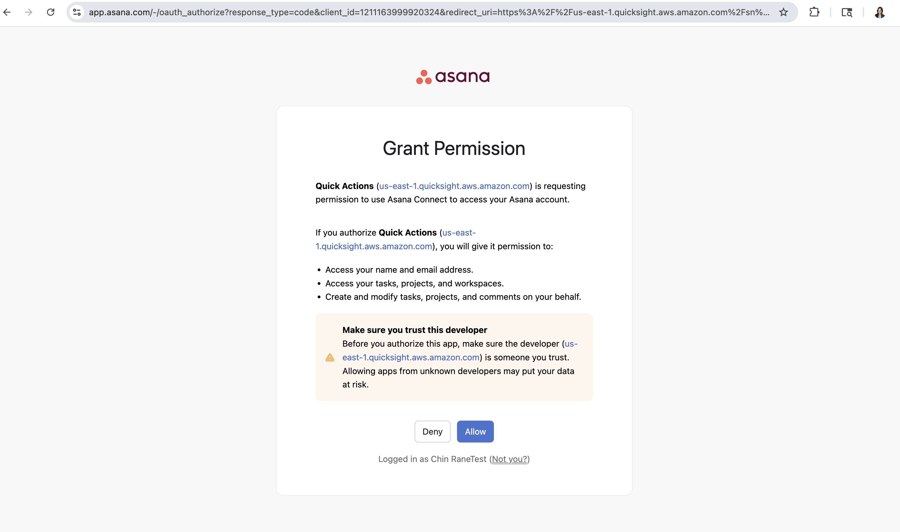
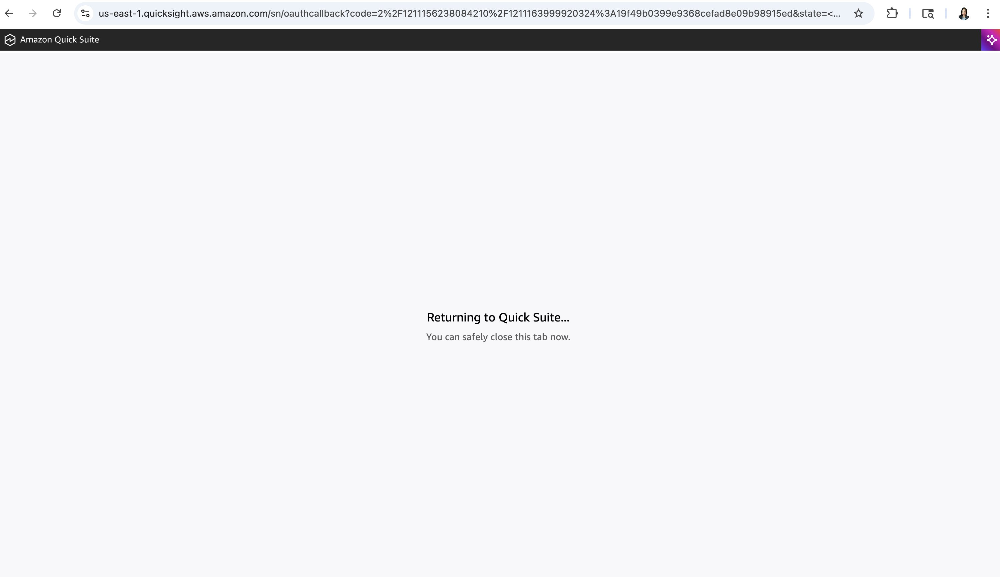

# Asana - Action Setup Guide

Asana is a web-based work management platform that helps teams organize, collaborate, and plan tasks. If you're an Asana user, you can create an Amazon Quick Suite Action to allow your end users to create and update tasks from within their Quick Assistant chat.

Follow the step by step instructions to set up Asana Action in your Quick Suite.

## Asana Prerequisites

### Step 1: Register Application on Asana

Register an application on Asana (<https://app.asana.com/0/my-apps>)

You must first register your application with Asana to receive a client ID and client secret. To do so, first visit the Asana developer console and select **Create new app**, as shown below:

### Step 2: Configure OAuth Application

To build a proper OAuth flow, you must supply your new application with three key details:

**App name** - The name for your application. Users will see this name when your application requests permission to access their account as well as when they review the list of apps they have authorized.

**Redirect URL** - Otherwise known as the callback URL, this is where the user will be redirected upon successful or failed authentication. Add `https://us-east-1.quicksight.aws.amazon.com/sn/oauthcallback` as the Redirect URL as shown below:

**(OAuth) Permission scopes** - You'll need to specify which OAuth scopes your app can request during this registration step. Only these pre-approved scopes will be accepted later during user authorization.

Also make sure to select the workspace you want this app to work with under **Choose distribution method**.

## Quick Suite Actions Setup

### Step 3: Access Quick Suite Actions

Go to Quick Suite → Go to Left-hand side bar → Under **Connections**, Choose **Actions**

Click **Asana** → Choose **Next**

### Step 4: Configure Asana Connection

Fill the necessary details for enabling the Asana connection → Choose **Add**:

**Name**: Asana Actions

**Base URL**: Asana org URL, For eg.: `https://app.asana.com/api/1.0`

**Client ID**: The client ID you generated when you create your OAuth 2.0 app in Asana

**Client secret**: The client secret you generated when you create your OAuth 2.0 app in Asana

**Token URL**: `https://app.asana.com/-/oauth_token`

**Authorization URL**: `https://app.asana.com/-/oauth_authorize`

**Redirect URL**: `https://us-east-1.quicksight.aws.amazon.com/sn/oauthcallback`

### Step 5: Authorize Connection

Once you add the Asana Action successfully, you are able to view the Summary details. Next, click on **Sign in**. You will be prompted by the Asana application to either grant or deny the application to access to their account.

Once granted access, you can now begin testing Quick with Asana Actions!
