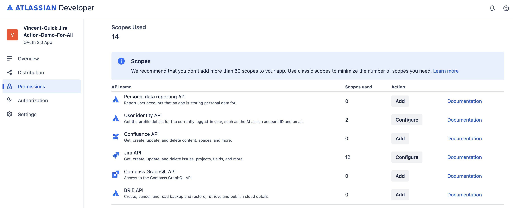
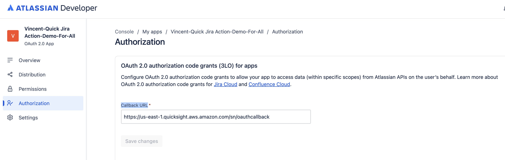
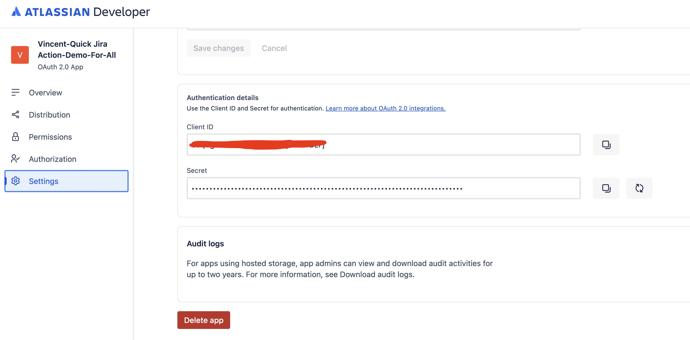
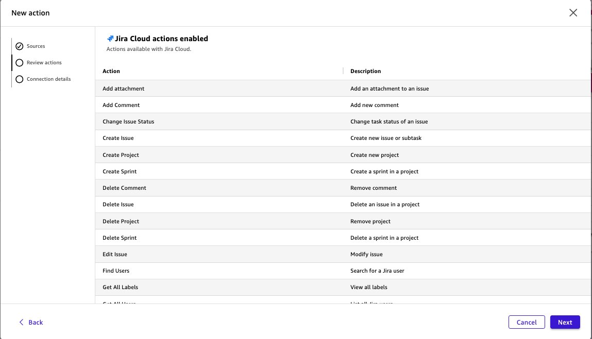
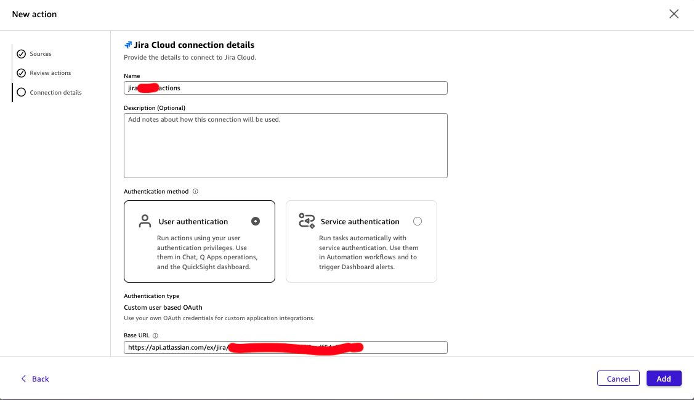
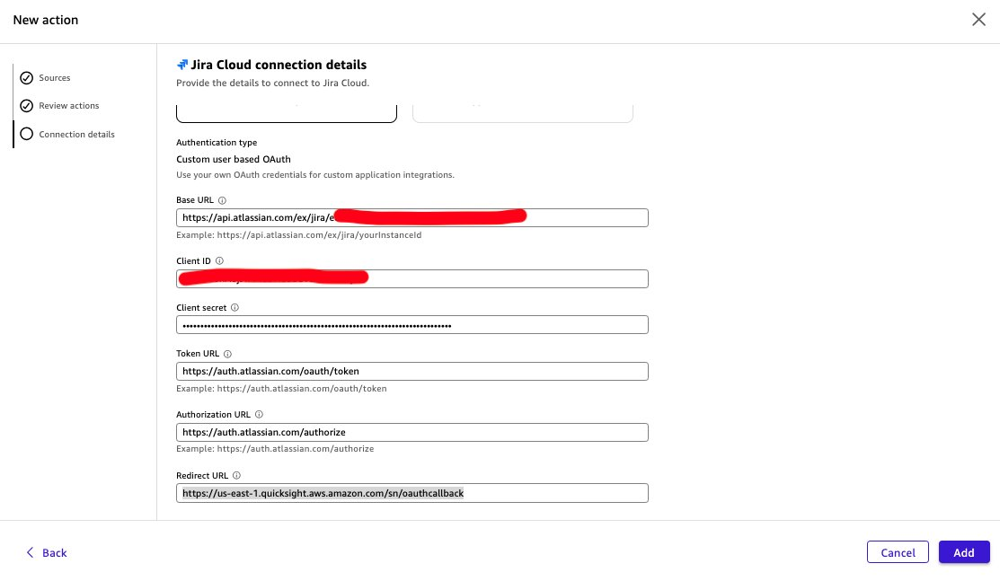
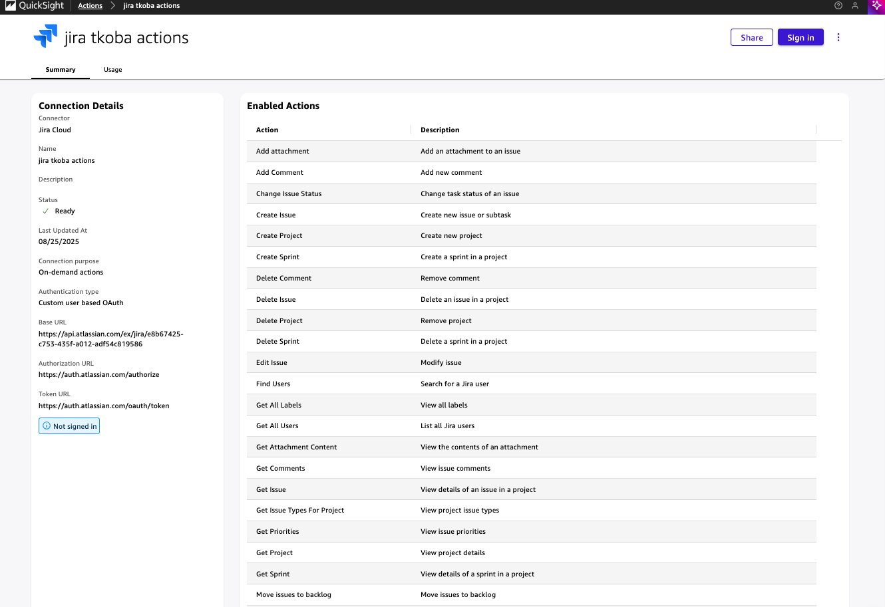
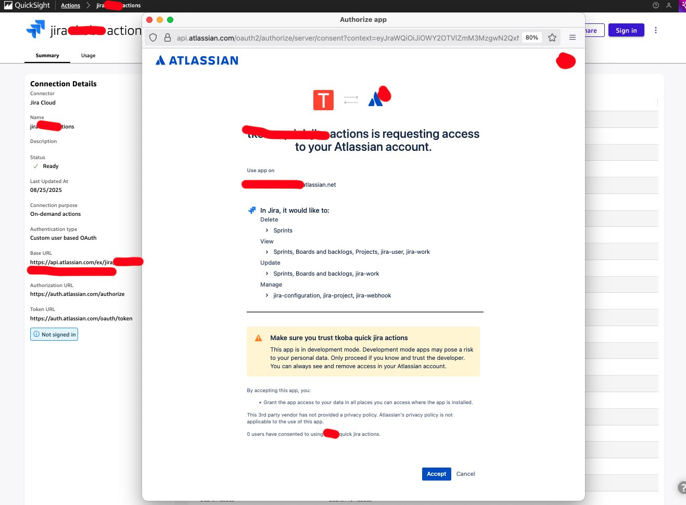
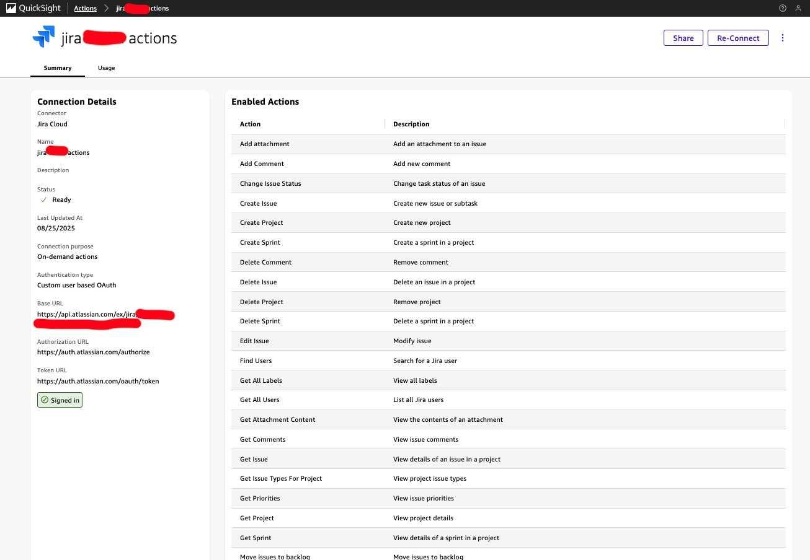

# Jira Cloud - Action Setup Guide

1) Visit <https://developer.atlassian.com/console/myapps/> and login with your account and go to **My apps** page

2) Click **Create**, and select **OAuth 2.0 Integration**

3) Insert the Name and click **Create**

4) Once created, click on **Permissions** to edit

5.1) You will need to add scopes from Jira API:

Here're the required scope list (more than Q Business's Jira plugin scopes):

From **Jira API**, add:

**Classic scopes**:

- `read:jira-work`
- `write:jira-work`
- `read:jira-user`
- `manage:jira-configuration`
- `manage:jira-webhook`
- `manage:jira-project`

**Granular scopes**:

- `read:sprint:jira-software`
- `write:sprint:jira-software`
- `delete:sprint:jira-software`
- `read:board-scope:jira-software`
- `read:project:jira`
- `write:board-scope:jira-software`

5.2) Navigate to **Authorization** => **Configure** and add this Callback URL (e.g. for us-east-1 region):

`https://us-east-1.quicksight.aws.amazon.com/sn/oauthcallback`

6) Go back to **Settings**, under Authentication details:

   Copy **Client ID** and **Secret** values, as these will be used in next step

7) Go to **AWS** > **Quick Suite** page, and click on **Integration**:

8) Select **Jira Cloud**, then **Next**

9) On Jira Cloud connection details page, insert the following as below:

**Base URL** - ie `https://api.atlassian.com/ex/jira/<instance ID>` *instance ID is retrieved from below step

To retrieve Instance ID that will be used later as Domain URL, go to `https://<your namespace>.atlassian.net/_edge/tenant_info`

ie. `https://<your namespace>.atlassian.net/_edge/tenant_info`

cloudId returned is the Instance ID

**Client ID**: copy the value from step 6

**Client secret**: copy the value from step 6

**Token URL**: `https://auth.atlassian.com/oauth/token`

**Authorization URL**: `https://auth.atlassian.com/authorize`

**Redirect URL**: `https://us-east-1.quicksight.aws.amazon.com/sn/oauthcallback`

10) Click on **Sign in** and pop-up window will display

11) Click on **Accept**, and confirm the pop-up screen closing.

12) Now the action summary page should show as '**Signed in**'

13) In Quick Suite, while creating chat agent, you can now link this action to the chat agent.

