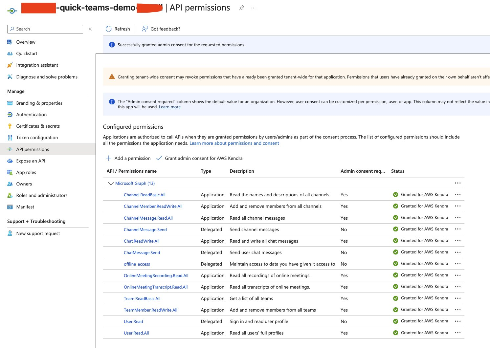
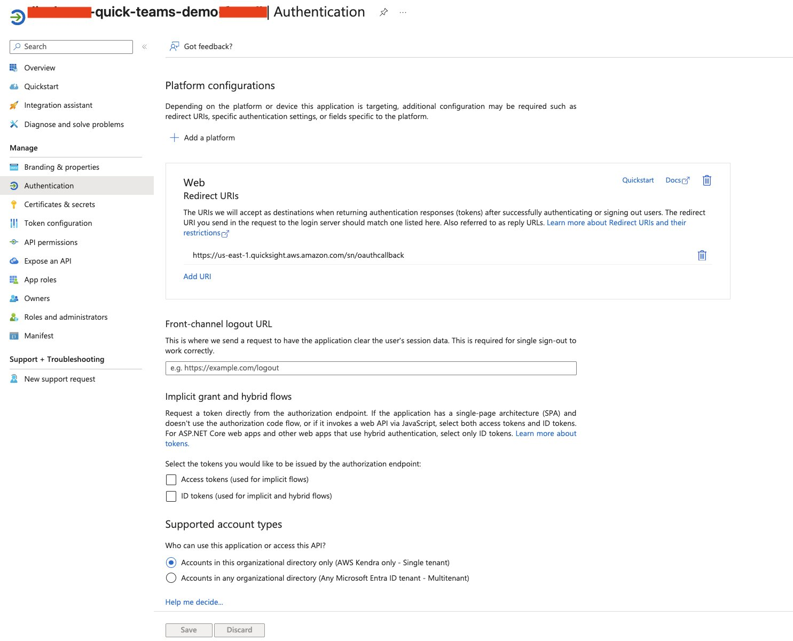
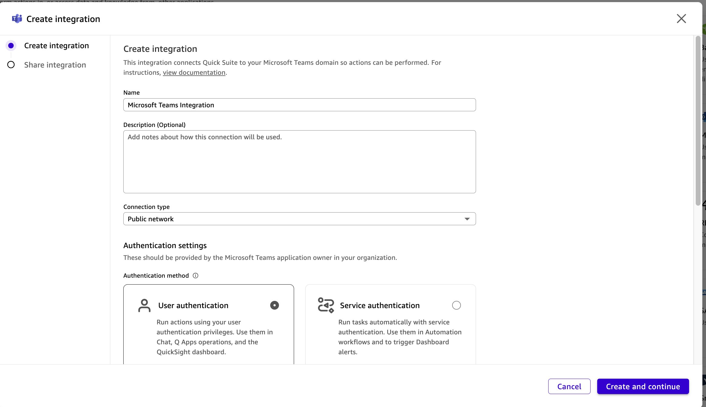
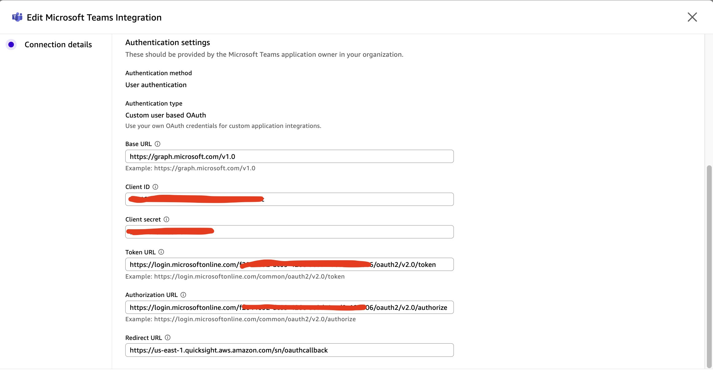

# MS Teams - Action Setup Guide

1) Sign in to the Microsoft Entra admin center as at least an Application Developer.

2) Browse to **Entra ID** => **App registrations** and select **New registration**

   Choose **Single tenant** and provide optional Redirect URI: `https://us-east-1.quicksight.aws.amazon.com/sn/oauthcallback`

   Click **Register** button:

3) Navigate to this app registration => **API permissions** => **Add a permission** => **Microsoft Graph API**:

   **Note**: Leave the pre-selected User.Read there.

   From **Application permissions**, select:

   - `User.Read.All`
   - `ChannelMessage.Read.All`
   - `ChannelMember.ReadWrite.All`
   - `Team.ReadBasic.All`
   - `Channel.ReadBasic.All`
   - `OnlineMeetingRecording.Read.All`
   - `OnlineMeetingTranscript.Read.All`
   - `Chat.ReadWrite.All`
   - `TeamMember.ReadWrite.All`

   From **Delegated permissions**, select:

   - `offline_access`
   - `ChannelMessage.Send`
   - `ChatMessage.Send`

   Then click on **Grant admin consent for <XXXX>**, you'll see a total of 13 permissions as:

4) From **Certificates & secrets** => **Client secrets** => **+ New client secret**, copy client secret value

   (**Note**: only copy the secret **Value**, NOT the Secret ID)

5) Also copy the **Client ID** and **Tenant ID** from there:

6) If not yet provided Redirect URI in step 2), then go to **Authentication** => **Add a platform** => **Web**, provide redirect URL:

   `https://us-east-1.quicksight.aws.amazon.com/sn/oauthcallback`

7) Go to **AWS** > **Quick Suite** page, and click on **Integration**:

8) Select **Microsoft Teams** then **Next**

   **Base URL**: `https://graph.microsoft.com/v1.0`

   **Client ID**: copy the value from step 5

   **Client secret**: copy the value from step 4

   **Token URL**: `https://login.microsoftonline.com/{your_tenant_id}/oauth2/v2.0/token`

   **Authorization URL**: `https://login.microsoftonline.com/{your_tenant_id}/oauth2/v2.0/authorize`

   **Redirect URL**: `https://us-east-1.quicksight.aws.amazon.com/sn/oauthcallback`

   **Note**: `{your_tenant_id}` is copied from step 5).

9) Click on **Create and continue**

10) Navigate to **Integration** => **Actions** => **Microsoft Teams Integration** (or your MS Teams integration name), and click on **Sign in**:

11) Check **Consent on behalf of your organization** and click **Accept**:

12) In Quick Suite, while creating chat agent, you can now link this action to the chat agent.
