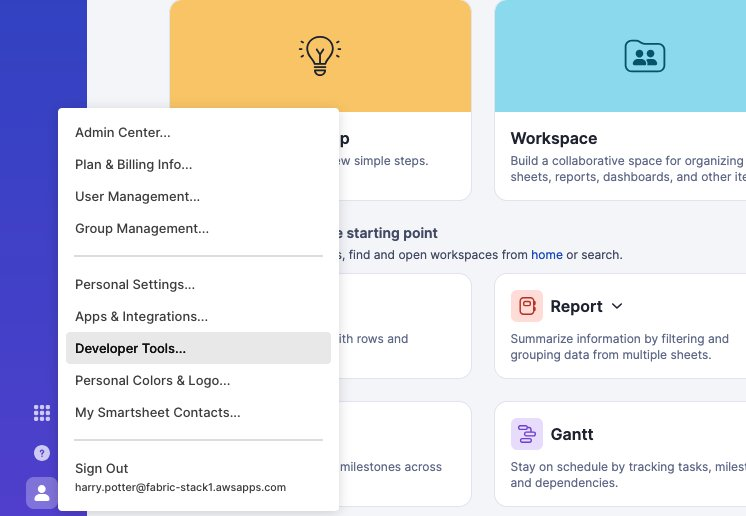
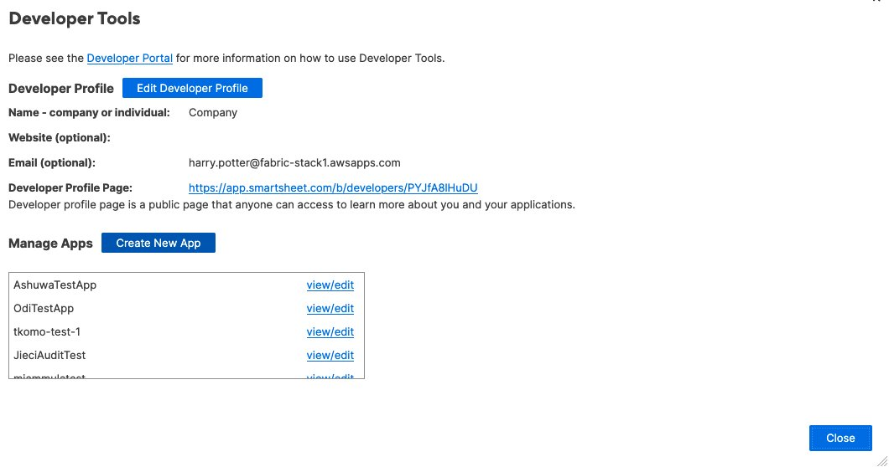
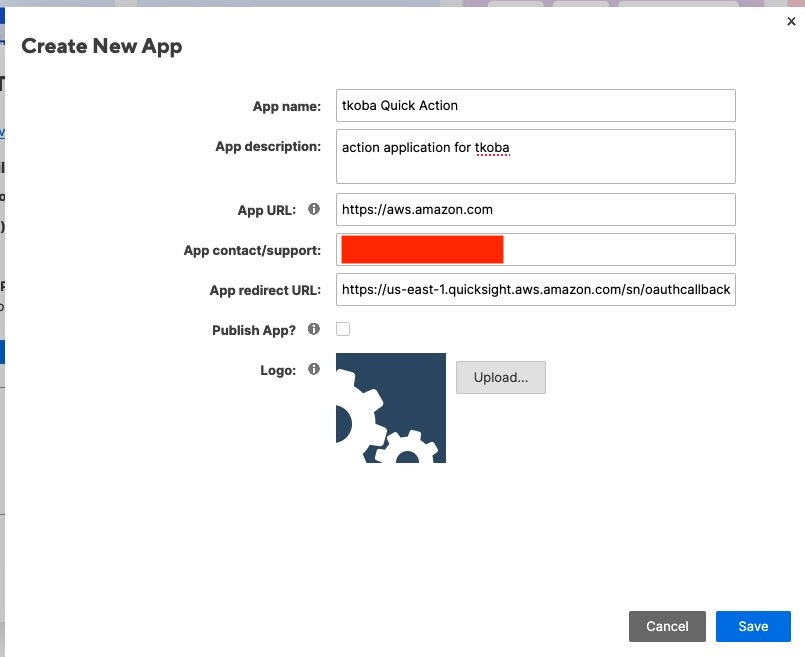
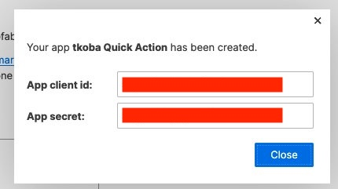
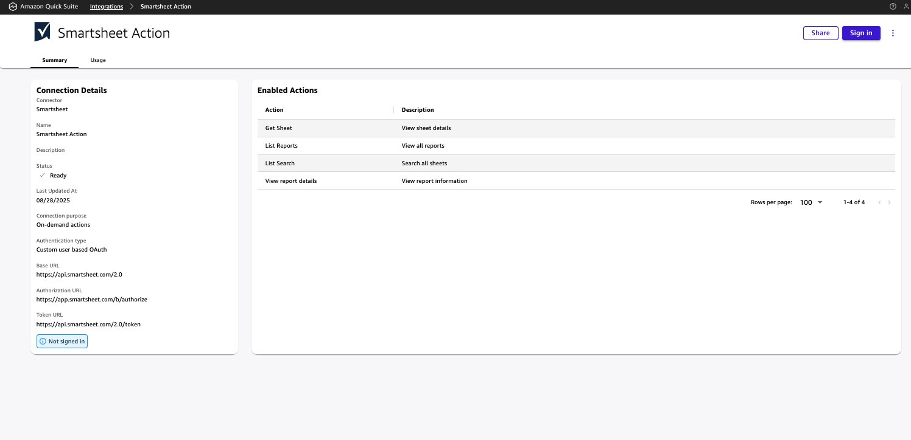
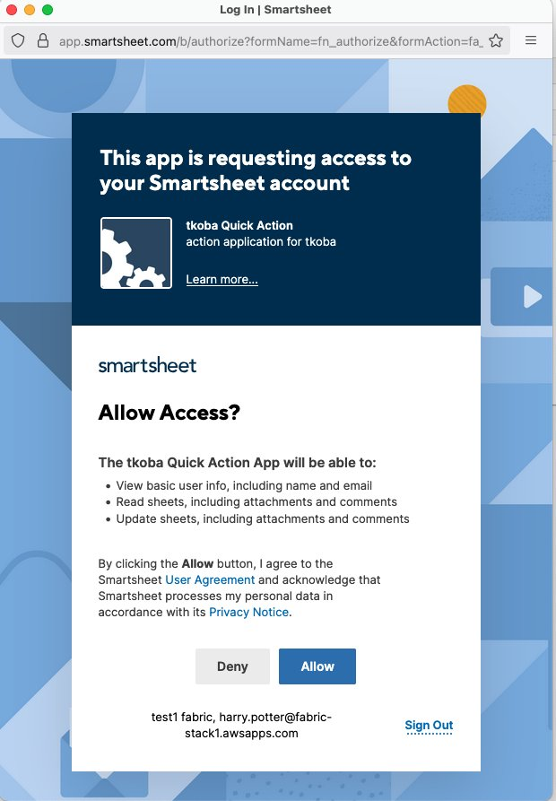
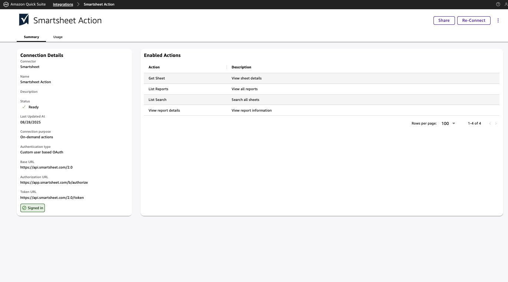

# Smartsheet - Action Setup Guide

1) Go to <https://app.smartsheet.com/b/home> and from left bottom corner, choose **Developer Tools**

2) Click on **create new app**

3) Insert required information

   App redirect URL is `https://<region>.quicksight.aws.amazon.com/sn/oauthcallback`

4) Once app is created, you will receive client id and secret. Copy this for next steps

5) Go to **Quick** > **Integrations** > **New Action** > choose **Smartsheet**. Insert the client id and secret from previous step

6) Once action is created successfully, click on **sign-in**. You will get pop-up window

7) Click **Allow** to complete the sign-in

8) If the action shows as signed in at the left bottom corner, you are ready to use action.

