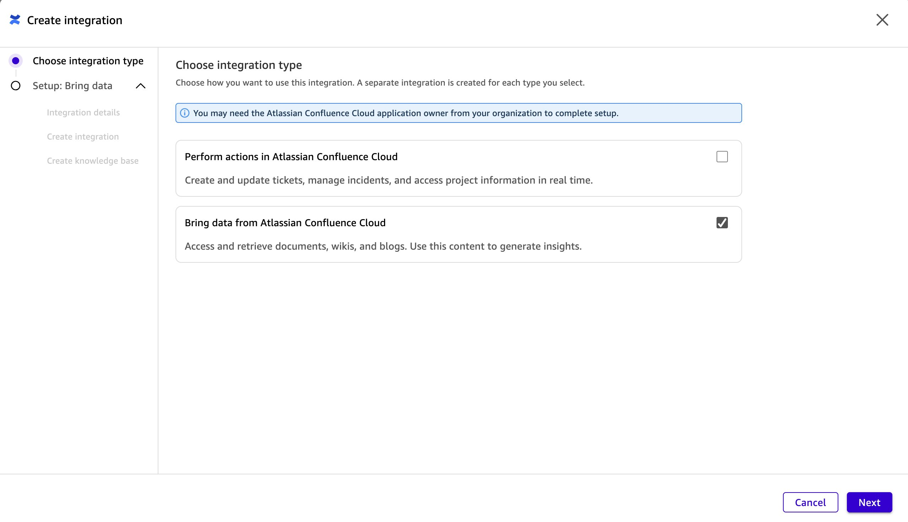
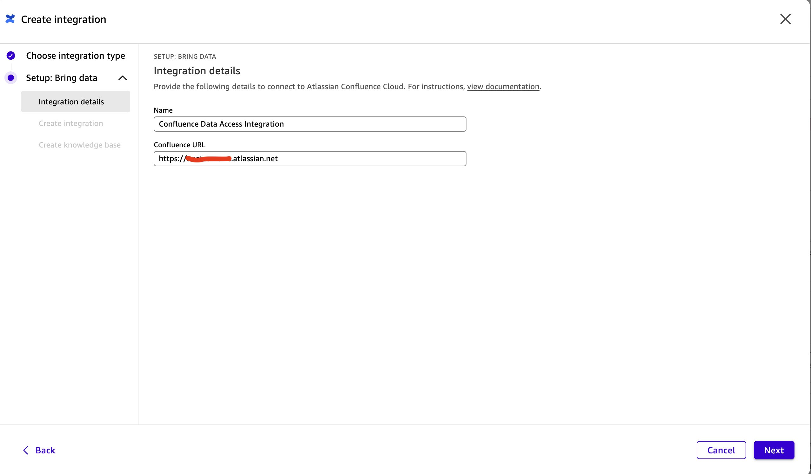
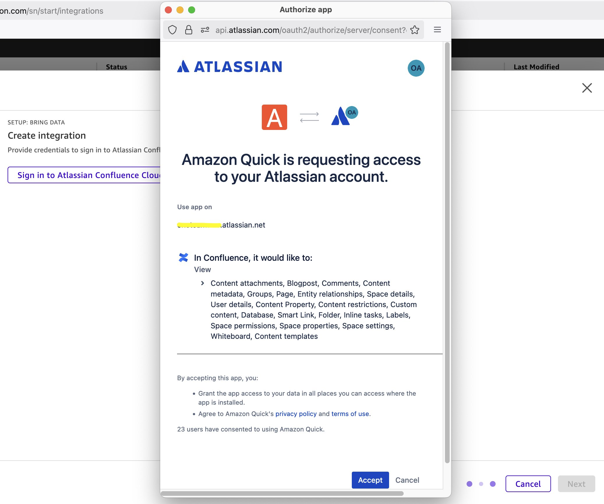
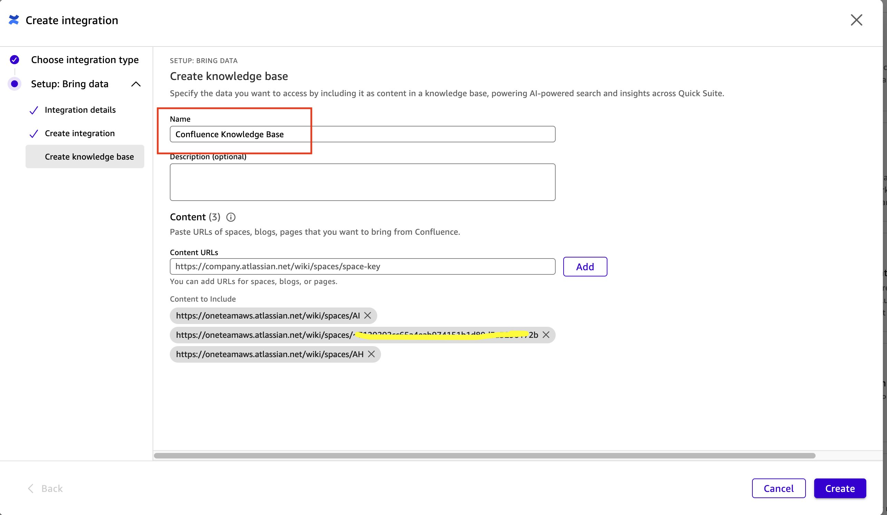
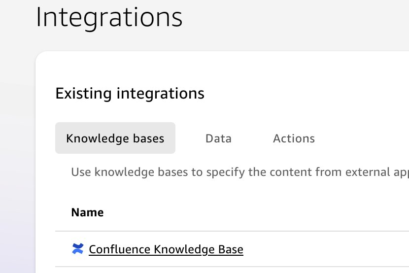

# Confluence Cloud - Knowledge Only Setup Guide

1) Select **Integration** => **Atlassian Confluence**, then **Next**

2) Choose integration type:

   **Bring data from Atlassian Confluence**: This creates a Confluence **knowledge base** (read-only access)
   

3) Enter **Confluence URL**:

   `https://<your_confluence_domain>.atlassian.net`

   

4) Click on **Sign in** and pop-up window will display

   

5) Click on **Accept**, and confirm the pop-up screen closing.

6) Now the action summary page should show as '**Signed in**'

7) **Rename** it to **Confluence Knowledge Base**

   At least 1 Content URL is required following format of:

   `https://<your_confluence_domain>.atlassian.net/wiki/spaces/space-key`

   To ingest multiple Confluence spaces, add them one by one like this:

   

8) Once created, it'll appear under **Integrations** => **Knowledge bases**

   

9) Chat within chat agent and reference this Confluence knowledge base.
