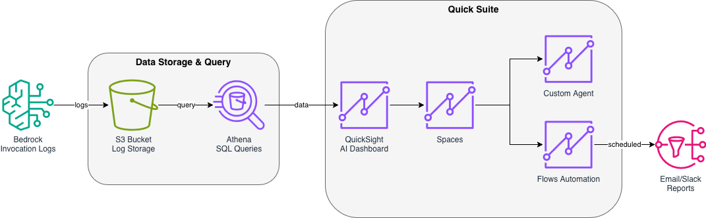

# GenAI Operations Hub

Build an AI-powered operations dashboard for Amazon Bedrock invocation logs using Amazon QuickSight Q, Spaces, and Flows.

## Overview

This solution enables leaders and engineers to:
- **Analyze** Bedrock usage trends with AI-built dashboards
- **Chat** with custom agents that understand your operational data
- **Automate** daily reports via email or Slack

## Architecture




## What's Included

- **Infrastructure as Code**: CDK stack to provision S3, Athena, and QuickSight resources
- **Sample Data**: Real Bedrock invocation logs for testing
- **Step-by-Step Guides**: Console-based instructions for each task

## Tasks

1. **AI Dashboard** - Use QuickSight Generative BI to build visualizations with natural language
2. **Create Space** - Set up a QuickSight Space with your dashboard
3. **Custom Agent** - Build a chat agent connected to your Space
4. **Flow Automation** - Schedule daily reports to email/Slack

## Prerequisites

- AWS Account with Bedrock invocation logs enabled
- QuickSight Enterprise Edition subscription
- Permissions for S3, Athena, QuickSight, and IAM

## Quick Start

### Deploy Infrastructure

```bash
cd infrastructure
python3 -m venv .venv
source .venv/bin/activate
pip install -r requirements.txt

# Set your QuickSight username (optional, defaults to Admin/cmakinen)
# Format: IAMRoleName/SessionName for federated users
# export QUICKSIGHT_USER="YourIAMRole/your-session-name"

cdk bootstrap
cdk deploy
```

### Extract and Upload Sample Data

```bash
# Generate sample data
cd infrastructure/data-generators
python3 generate_all_data.py

# Upload to S3
cd ../sample-data
aws s3 cp bedrock-logs/ s3://genai-ops-bedrock-logs-<ACCOUNT_ID>/ --recursive
```

### Follow Task Guides

Navigate to the `docs/` folder and follow each guide in order. Start with creating your AI-powered dashboard!

## Repository Structure

```
genai-operations-hub/
├── README.md
├── architecture/
│   └── architecture-diagram.png
├── infrastructure/
│   ├── app.py
│   ├── cdk.json
│   ├── requirements.txt
│   ├── data-generators/
│   │   └── generate_all_data.py
│   └── stacks/
│       └── genai_ops_stack.py
└── docs/
    ├── 0-setup.md
    ├── 1-ai-dashboard.md
    ├── 2-create-space.md
    ├── 3-custom-agent.md
    └── 4-flow-automation.md
```

## Contributing

See the [Amazon Quick Suite Knowledge Hub Contribution Guide](https://aws-samples.github.io/sample-amazon-quick-suite-knowledge-hub/HOW-TO-CONTRIBUTE/)

## License

This library is licensed under the MIT-0 License. See the LICENSE file.
